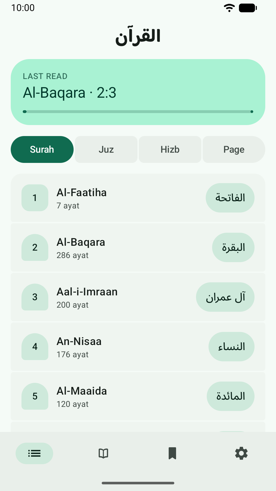
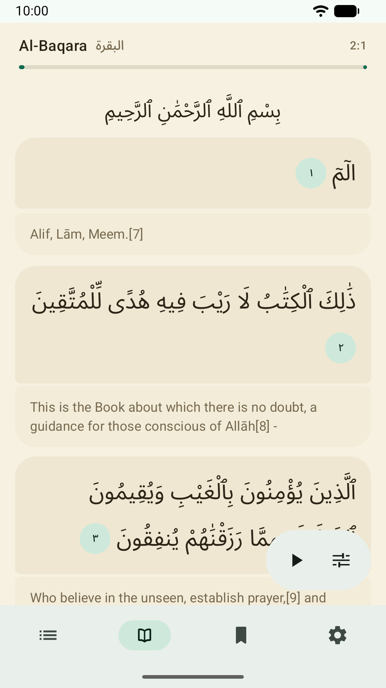
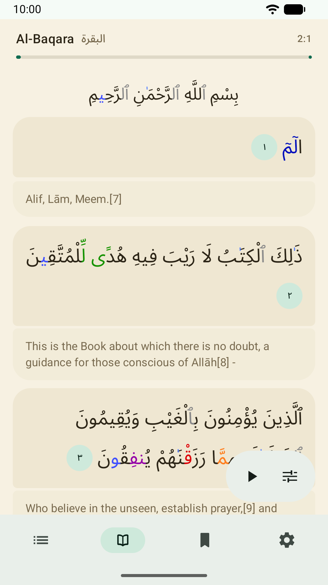
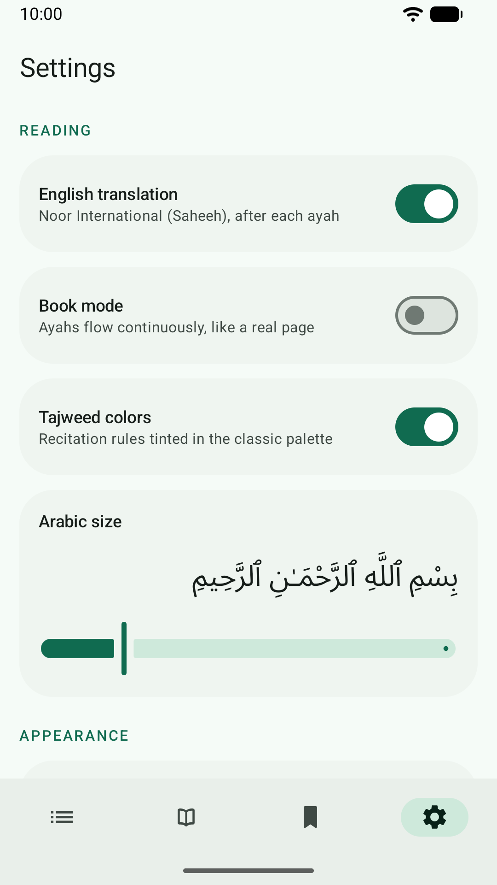

# Material Quran

An offline Quran reader for Android, built with Jetpack Compose and Material 3
Expressive.

Free, no ads, no
accounts, no analytics.


<p align="center">
  
  
  
  
</p>

## Building

```bash
./gradlew :app:assembleDebug          # debug APK
./gradlew :app:testDebugUnitTest      # unit tests
./gradlew :app:lintVitalRelease       # the lint pass that gates a release build
./gradlew :app:bundleRelease          # signed release .aab (needs keystore.properties)
```

Unit tests run on **JDK 21** via the foojay toolchain resolver in
`settings.gradle.kts`; the app itself targets 17.

`bundleRelease` needs a gitignored `keystore.properties` in the repo root:

```properties
storeFile=upload-keystore.p12
storePassword=…
keyAlias=upload
keyPassword=…
```

Without it the build still configures, it just produces an unsigned artifact.
The `.p12` is the **upload key**, not the app signing key, which Google holds
under Play App Signing.

| Asset | Terms |
|---|---|
| Arabic text | [Tanzil Project](https://tanzil.net), CC BY 3.0. Redistributed verbatim; Tanzil's terms also state that changing it is not allowed. |
| English translation | Noor International (Saheeh) via [QuranEnc.com](https://quranenc.com). Republished unmodified, which is a condition of their terms. |
| Tajweed annotations | [cpfair/quran-tajweed](https://github.com/cpfair/quran-tajweed), CC BY 4.0. Offsets were re-based; see ATTRIBUTION.md. |
| Noto Sans Arabic, Baloo Bhaijaan 2 | SIL Open Font License 1.1. |

Recitation audio is **not** bundled. It is downloaded from everyayah.com at the
user's request and remains the property of each reciter and producer.
